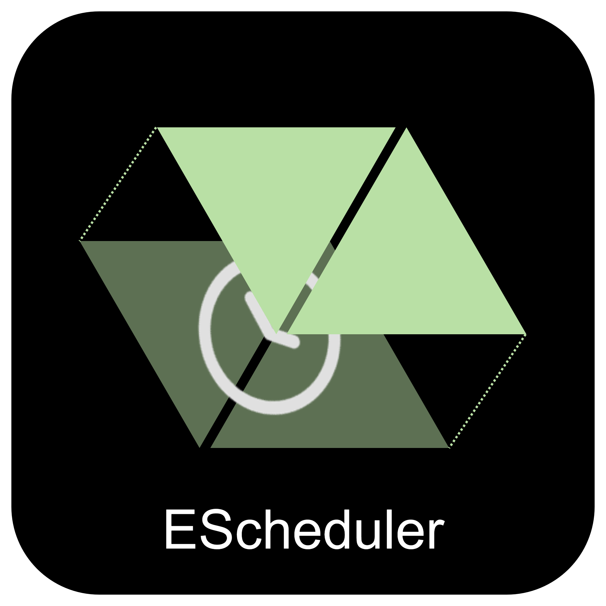

# EScheduler - 排程任務管理系統

<div align="center">
  <h3>🚀 強大的分散式排程任務管理平台</h3>
      
  <p>AWS EventBridge Alternative 基於 FastAPI + Vue3 + Vuetify 構建的現代化排程系統</p>
</div>

---

## ✨ 功能特色

### 🎯 核心功能

- **多種排程類型**：支援 Cron 表達式和 Rate 間隔排程
- **多目標執行**：HTTP、Webhook、RabbitMQ、Email 等多種執行目標
- **可視化管理**：直觀的 Web 界面，支援任務創建、編輯、監控
- **排程助手**：類似 crontab.guru 的可視化 Cron 編輯器
- **實時監控**：任務執行狀態、歷史記錄、統計報表
- **錯誤處理**：重試機制、死信佇列、異常通知

### 🛠️ 技術架構

- **後端**：FastAPI + Python 3.12+
- **前端**：Vue 3 + Vuetify + TypeScript
- **資料庫**：PostgreSQL + Tortoise ORM
- **排程引擎**：APScheduler
- **容器化**：Docker + Docker Compose
- **監控**：Prometheus + Grafana

---

## 📋 系統需求

### 必要環境

1. **uv** - Python 套件管理器
2. **Python 3.12+** - 程式語言
3. **Node.js 22+** - 前端開發環境
4. **Docker** - 容器化平台
5. **Docker Compose** - 多容器應用管理
6. **pnpm** - 前端套件管理器

### UV 安裝

#### Windows

```powershell
powershell -ExecutionPolicy ByPass -c "irm https://astral.sh/uv/install.ps1 | iex"
$env:Path = "{HOME_DIRE}\.local\bin;$env:Path"
```

#### Linux/MacOS

```bash
curl -LsSf https://astral.sh/uv/install.sh | sh
```

---

## 🚀 快速開始

### 1. Clone 專案

```bash
git clone <repository-url>
cd EScheduler
```

### 2. 環境配置

```bash
# 複製環境變數範本
cp .env.example .env

# 編輯環境變數（根據需要調整）
# 主要配置：資料庫連接、Redis 連接等
```

### 3. 啟動基礎服務

```bash
# 啟動 PostgreSQL、Redis、Prometheus、Grafana
docker-compose up -d
```

### 4. 後端設置

```bash
# 安裝 Python 依賴
uv sync

# 啟動後端服務
uv run python main.py
```

### 5. 前端設置

```bash
# 進入前端目錄
cd frontend

# 安裝依賴
pnpm install

# 啟動開發服務器
pnpm dev
```

### 6. 訪問應用

- **前端界面**：http://localhost:3000
- **後端 API**：http://localhost:8000
- **API 文檔**：http://localhost:8000/docs
- **Grafana 監控**：http://localhost:3001 (admin/admin)
- **Prometheus**：http://localhost:9090

---

## 📖 使用指南

### 創建排程任務

1. **使用 Web 界面**
   - 訪問 http://localhost:3000
   - 點擊「創建任務」
   - 使用排程助手生成表達式
   - 配置目標和參數

2. **使用 API**

```bash
curl -X POST "http://localhost:8000/api/scheduler/" \
     -H "Content-Type: application/json" \
     -d '{
       "name": "每日健康檢查",
       "description": "每天早上9點檢查服務狀態",
       "schedule_expression": "cron(0 9 * * *)",
       "target_type": "http",
       "target_arn": "https://api.example.com/health",
       "target_input": {
         "method": "GET",
         "headers": {
           "Accept": "application/json"
         }
       }
     }'
```

### 排程表達式範例

#### Cron 表達式

- `cron(0 9 * * 1-5)` - 工作日早上9點
- `cron(*/15 * * * *)` - 每15分鐘
- `cron(0 0 1 * *)` - 每月1號午夜

#### Rate 表達式

- `rate(5 minutes)` - 每5分鐘
- `rate(1 hour)` - 每小時
- `rate(30 seconds)` - 每30秒

### 目標類型配置

#### HTTP 請求

```json
{
  "target_type": "http",
  "target_arn": "https://api.example.com/endpoint",
  "target_input": {
    "method": "POST",
    "headers": {
      "Content-Type": "application/json",
      "Authorization": "Bearer token"
    },
    "data": {
      "key": "value"
    }
  }
}
```

#### Email 通知

```json
{
  "target_type": "email",
  "target_arn": "recipient@example.com",
  "target_input": {
    "subject": "排程任務通知",
    "body": "任務執行完成",
    "sender": "noreply@example.com"
  }
}
```

[](https://codecov.io/github/fan9704/EScheduler)